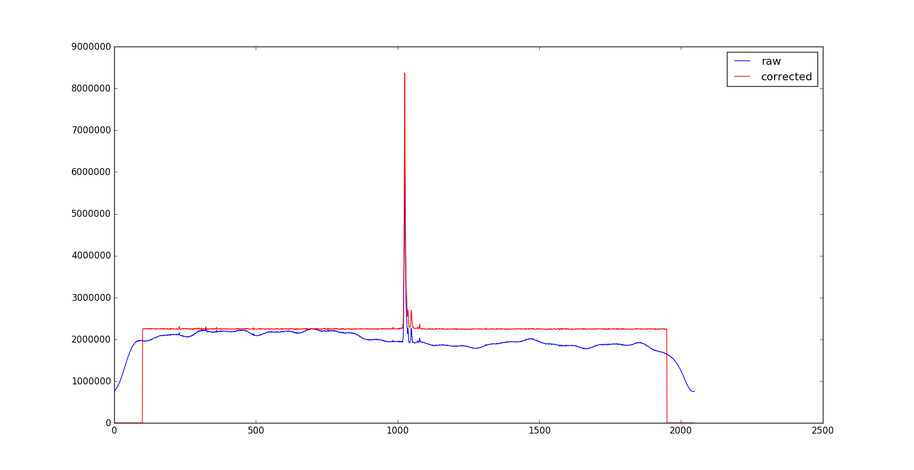

====================
Band Pass Correction
====================

The DW package includes also a tool for the *correction* of the band pass, BPC.

Note that this tool is not for calibration purposes and
**has not been tested yet**.

The uderlying idea is to correct data for the shape of the bandpass, to make
it easier the subsequent identification of RFI with dedicated automatic
algorithms.

The bandpass shape is computed on raw data that are free from source and RFI
signal. Such data must be carefully selected by the user and are processed to
derive a polynomial curve, describing the bandpass shape, that will be later
used to correct the raw data themselves.

The bandpass correction can be subdivided in the following steps:

* Select the useful data by automatically evalutating the median (in the time domain) of every subscan
* Build the bandpass curve by median-combining all the selected data
* Fit the bandpass curve
* Normalize the fit at peak value
* Divide each selected raw data by the normalized curve, create a new "corrected" data table and append it to the original file

An example of raw and corrected data is shown below.

The operations performed by the Band Pass Correction "deform" the original data, thus this tool is not intended for subsequent quantitative measurements but only to facilitate the flagging.

BPC provide, like DW, two types of interface:

* a :doc:`tuibp`
* a :doc:`guibp`

.. toctree::
   :maxdepth: 2

   tuibp
   guibp
   correction_file
