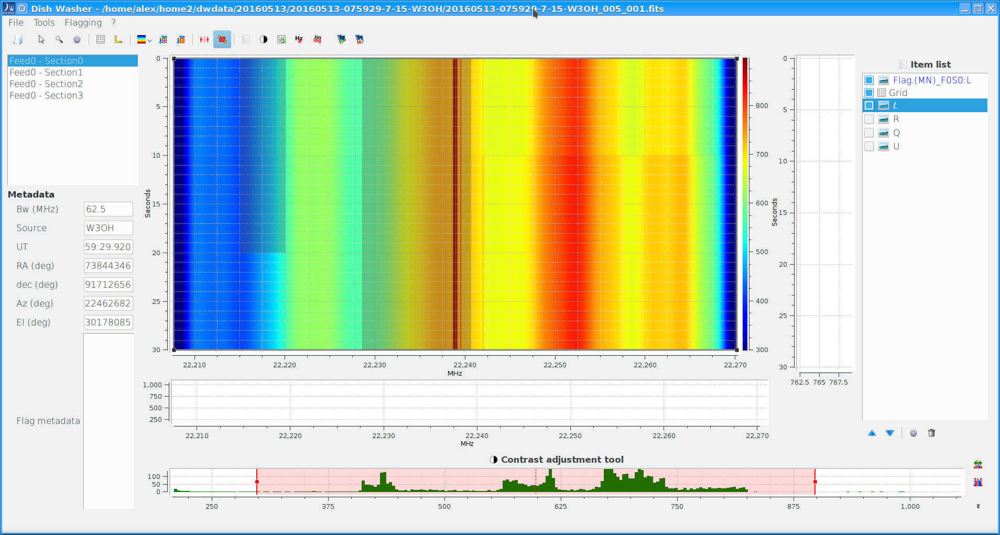

==========================
Graphical user's interface
==========================

The graphical users's interface provides access to the DW functionalities available 
with the text interface and data visualization.

Interface elements
==================
In this Figure an example of the DW GUI is given.

The GUI consists of several panels:

Datasets and metadata
^^^^^^^^^^^^^^^^^^^^^

On the left side of the GUI there:

* *top*: a list of selectable datasets found in the file.
         A data file may contain data from a number of feeds, each contaning information from a number of spectral sections.
         In the above example, the observation has been done with a mono-feed receiver (there is only Feed 0) and contains data from the four different spectral sections delivered by the backend.
         In this panel one can select the proper combination of feed+spectral section, and the correspondent
         data are shown in the waterfall plot (see below).

* *bottom*: a number of metadata characterizing the observation and flagging.
            Observational metadata are taken from the headers of the FITS files.
            Flagging metadata are listed if data already contain a flagging table (see next chapters).
            The listed metadata are:

            - *Bandwidth:* Is a float number expressing the bandwidth of the dataset, in MHz.
            - *Source:* Name of the observed source.
            - *UT:* UT of the observation.
            - *RA:* Right Ascension (degrees)
            - *Dec:* Declination (degrees)
            - *Az:* Azimut (degrees)
            - *El:* Elevation (degrees)
            - *Flag Metadata:* A list of metadata of the selected flag. These values depends of the method by which the flag was defined.

Item list
^^^^^^^^^^^^^^^^^^^

On the right of the main window there is an item list that displays data from the combination
feed+section that has been selcted in the left panel. Typically, the L, R, Q, U (if 
present) are listed. Also the flagging regions are listed here, as well as other items
like cross sections (see below).

DW differentiates between "visualization" and "action".
The *visualization* of an item is regulated by its
associated tickmark in the list. To actually *act* (i.e. perform flagging, cross sections etc.) 
with the available tools on one item, tickmarking is not enough. The item itself has to be 
highlighted by clicking on it with the mouse, and it becomes highlighted in blue.

The item list is equivalent to a hierarchy of layers in the central panel. If more than one
item is tickmarked, the first item in the list is the visible layer. 

The flagged regions are shown as grey areas of different transparency depending if they have 
been already
saved in the data or not. Light grey is used for already saved flagging regions.

By default, a Grid item is always present and can be deactivated by un-tickmarking it.

Waterfall plot and cross-sections
^^^^^^^^^^^^^^^^^^^^^^^^^^^^^^^^^

At the centre of the GUI the waterfall image of the selected data is shown. The x and y axes
of the image represent respectively frequency and time. Default units are respectively MHz and 
sec.
On the sides of the image, there are two panels used to display the cross-section tool results. 

Data cross sections are displayed by means of the *Cross section* tool, the *Average cross 
section*. The Average Cross Section computes and displays the cross section of data inside
the selected rectangular region.
Non-persistent cross section tool can be activated pressing *Alt* button and moving the 
mouse pointer over the data.

Data value in a given position can be retrieved by clicking the *Selection* button
(the arrow button belo thw Tools menu) and then moving the mouse pointer on the image while 
keeping the Alt key pressed.

Contrast tool
^^^^^^^^^^^^^

At the bottom of the GUI there is a panel to control the contrast levels of the 
item selected from the data list.

As already said, this tool *acts* on the selected item of the data list, so the item must
be selected and not only tickmarked.

Menus
~~~~~

*File* menu
^^^^^^^^^^^

* *Open:* start the open file dialog
* *Close:* close file
* *Quit:* quit DWData

*Tools* menu
^^^^^^^^^^^^

* *Ipython console:* start the Ipython console (currently works only inside spyder for debug purpouse)
* *Band pass correction tool:* Start the BPC tool (see :doc:`bpc`)
* *Open a correction file:* Load in DW a correction file generated by :doc:`bpc`
* *Apply/unapply correction:* Apply/remove a correction file generated by :doc:`bpc`. 
 
 
*Flagging* menu
^^^^^^^^^^^^^^^

* *Flag:* create a flagging matrix from the selected areas (require area/s is/are selected usign a selecion tool)
* *Deflag intesected:* deflag all previous flags intersecting a rectangle area (require area/s is/are selected usign a selecion tool) **BUG: THIS FEATURE IS NOT WORKING PROPERLY IN CURRENT VERSION**
* *Delete selected:* delete the selected flagging areas
* *Flag widget:* start the flag widget to flag time and/or channels range
* *Propagate flag table to files:* Appy an existing flag table to other data. **NOT IMPLEMENTED YET**
* *Auto RFI detection:* start the automatic RFI detection widget

Toolbar buttons
~~~~~~~~~~~~~~~

* *Open file:* start the open file dialog.
* *Selection:* if enabled, by keeping the Alt key pressend data
  values and coordinates at the cursor position are displayed.
* *Rectangle zoom:* zoom on the selected area
* *Parameters:* open a dialog to set some visualization parameter
* *Grid:* open a dialog to set some grid visualization parameter
* *Axes style:* open a dialog to set some axis visualization parameter
* *Select colormap:* select the colormap for the active data
* *Cross section:* create a cross section item
* *Average cross section:* create an average cross section item. It displays the averaged cross 
  sections of the selected area.
* *Channel range flagging:* manual tool to flag a channel (spectral) range.  It creates a 
  flagging item.
* *Area flagging:* manual tool to flag a rectangular. It creates a flagging item.
* *Item list manager:* toggle on/off the item list panel
* *Contrast panel:* toggle on/off the contrast panel
* *Grid:* toggle on/off the data grid
* *Toggle axis:* toggle axis measurement units from (MHz, sec) to (Channel Number -Time Sample).
* *Y scale toggle:* toggle on and off log scale on y axis **NB CHECK THIS **
* *Flag:* save the selected flagging items in the data flagging table. Multiple items can be
  selected and saved at once by keeping presseld the Shift key.
* *Deflag intesected:* deflag flagged regions intersected by a rectangular area **NOTE IT 
  CURRENTLY ACTS ONLY ON FLAGGED ITEMS NOT ALREADY SAVED IN THE FLAG TABLE**

