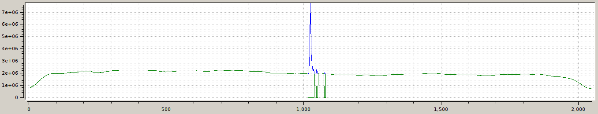
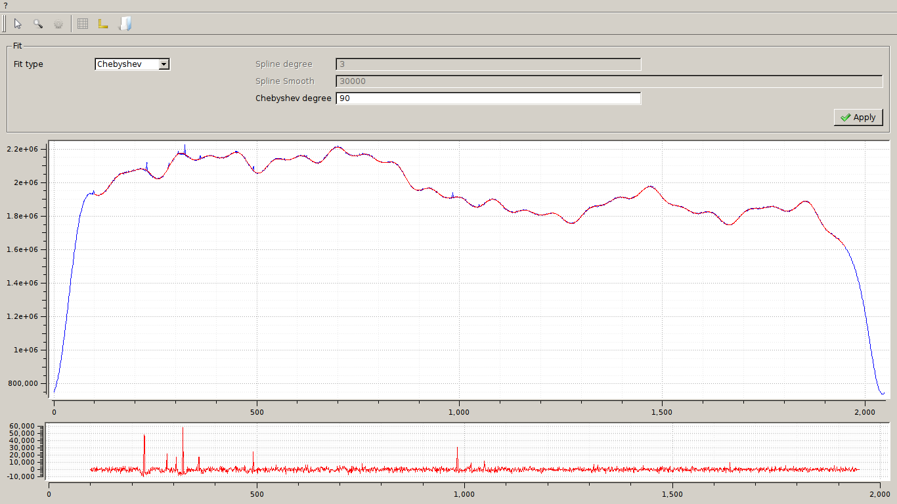

==========================
Graphical user's interface
==========================

The Graphical User Interface of the bandpass correction tool provides all the
text functionalities plus a graphical rappresentation of data.

The GUI can be launched with the command *bpcgui* or from the "tools" menu
in DW.

Interface elements
==================

Menu
~~~~

*File* menu
^^^^^^^^^^^

*Open:* start the "open directory" dialog box.

*Quit:* quit the Bandpass Correction Tool.

*?* menu
^^^^^^^^^^^

*About:*  version information

Toolbar buttons
~~~~~~~~~~~~~~~

* *Open file:* start the open directory dialog box.
* *Selection:* 
* *Rectangle zoom:* zoom on the selected area
* *Parameters:* open a dialog box to set some visualization parameter
* *Grid:* open a dialog box to set some grid visualization parameter
* *Axis style:* open a dialog box to set some axis visualization parameter
* *Get preflag:* open a file preflagged by DW **CLARIFY**
* *Fit:* open the fit window
* *Apply:* apply the correction curve to all, or part of, the data files in the directory

Main window
~~~~~~~~~~~

The main window, as we can see in the picture, is divided in five areas:

Current
^^^^^^^

A box with information on:

* *feed*
* *section*
* *polarization*
* *frequency*
* *bandwidth*
* *file for the preflag*

Dataset
^^^^^^^

A selector for the working dataset:

* *feed*
* *section*
* *polarization*

The *apply* button set the selected dataset. It will set the *dssel* parameter described in :doc:`tuibp`.

List
^^^^

A list of files in the observation directory, selectable by means of checkboxes. 

Here it is possible to select the files to be used for the correction curve
(**NOTE: also its application?**).

Selection
^^^^^^^^^

The selection box is divided in two subboxes:

* *Range settings*
* *Fit range*

The *range setting* can be used to set the type of observation and to set a range of spatial samples to be used for the median computation:

* *type of data:* the type of observation. Values are: "On/Off", "Cross Scan" and "Map"
* *select region inf:* set a number of spatial samples at the beginning of the data to be used for the median computation. A value equal to 0 means to use all available samples.
* *select region sup:* set a number of samples at the end of the data to be used for the median computation. A value equal to 0 means to use all available samples.
* *excluded region:* set a number of samples at the beginning and at the end of the data to be excluded from the computation (useful to exclude ramps).

The *select region inf* and *select region sup* are active only if *type of datas* is "Cross scan" or "Map".

The *fit range* parameter sets a range for the computation of the fit.
The fit is computed in the region included within *select fit region inf* and *select fit region sup*.

The *apply* button saves these settings and updates the plot.

Plot area
^^^^^^^^^

The area in which the median plot (blue) and median "cut" by preflagging, if applied (green) **[???**] are shown.

Fit Window
~~~~~~~~~~

In the toolbar of the Fit Window the folowing buttons are available:

* *Selection:* 
* *Rectangle zoom:* zoom on the selected area
* *Parameters:* open a dialog box to set some visualization parameter
* *Grid:* open a dialog box to set some grid visualization parameter
* *Axis style:* open a dialog box to set some axis visualization parameter
* *Save fit:* save the current fit to the "fit_data_correction.fits" file in the root direcory.

The fit window is divided in two areas:

* *fit settings* 
* *view area*

Fit settings
^^^^^^^^^^^^
These are:

*Fit type* is a selector for the type of the fit. Current supported types are:
* *Spline*
* *Chebyshev*

*Spline degree* and *Spline smooth* are free parameters for the spline method. The meaning of these parameters is explained in the :doc:`tuibp` section.

*Chebyshev degree* is the degree of the Chebyshev polynomes.

The button *apply* starts the computation and visualizes the result in the plot area.

Plot area
^^^^^^^^^

It is the area for visualizing the data (blue) and the fit (red).

Usage example
=============

Operations needed to build the the bandpass correction file and to apply it to
the raw data are the same of the text user interface case.

Once opened the directory of the observation, files browsing is possible thanks to the list widget. Also, selecting feeds, spectral sections and polarizations
is possible using the dataset box.

In the case of OTF observing modes ("Cross scan" or "Map") the
ranges of spatial samples to use are to be set, as explained in :doc:`tuibp`.

Tthanks to the checkboxes on the list widget, only the files whose median does not present excessive irregularities can be selected.

The fit window can be opened by means of the toolbar button. The window will
show the median of all the selected files.

Some tests to obtain the best fit possibile can be done, and result can be
finally saved by means of the toolbar button.
Fit data will be saved in the file "fit_data_correction.fits" file.

Once closed the fit window, one can perform the same operation on some or
all the feed/section/polarization combinations. Finally, the bandpass
correction can be applied to all the raw data files and for each of them the
FITS extension table containing corrected data is written.
