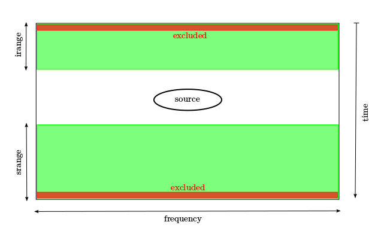

=====================
Text user's interface
=====================

The text user's interface can be used with any interactive python interpreter.

Peliminary steps
================

Importing the module
~~~~~~~~~~~~~~~~~~~~
::

        import dw.core.data_def as dw

This is the same DW module, and it will import also the text mode capabilities of BPC.

Instantiating a BPC class
~~~~~~~~~~~~~~~~~~~~~~~
::

        bpc = dw.DWObs()

This instantiates a BCP data object.

DWObs is a class with the following attributes:

*dir_name* is the directory name

*files_type* is the extension of the files in the direcory

*dir_datasets* is a list of DW object DWData()

*feeds* is a list of feeds

*sections* is a list of sections

*polars* is a list of polarizations

*dssel* is the current selection of feed, section and polarization

Opening data
============

Opening an observation directory
~~~~~~~~~~~~~~~~~~~~~~~~~~~~~~~~
::

        bpc.open_dir(dirname, [filestype])

*dirname* is a string containing the path to the directory containing the data to be used for bandpass correction computations.

*filestype* is a string denoting the fileype of the files in the observation directory. Current available filetypes are:

* *fits*: DW data format in a FITS container

When a directory is opened, all the data files inside that directory are opened as DWData() objetcs and listed in the attiribute *dir_datasets*.

Retrieving data
===============

Getting the median of a datasets
~~~~~~~~~~~~~~~~~~~~~~~~~~~~~~~~~~~~~~~~~~~~~~

A dataset may be composed by one or more FITS data files.

::

        bcp.get_median_data(ldataset, section, pol, lrangei, lranges, lexcluded)

*ldatasets* is a N-list of indices of the considered datasets

*section* is the index of the working section (starting from 0)

*pol* is the index of the working polarization (L=0, R=1, Q=2, U=3)

*lrangei* is a N-list of values of spatial samples at the beginning of each subscan to be used for computation of the median (for OTF scan observations). It assumes that a source, if prpesent, will not fall in the initial and final part of a subscan. A value equal to 0 means to use all the available spatial samples in the subscan.

*lranges* is a N-list of values of spatial samples at the end of the subscan to be used for computation of the median (for OTF scan observations). It assumes that a source, if prpesent, will not fall in the initial and final part of a subscan. A value equal to 0 means to use all the available spatial samples in the subscan.

*lexcluded* is a N-list of values of spatial samples to be excluded at the beginning and at the end of a subscan.

It returns a list of two np-arrays [x, y].

This function has been designed to compute both the median of the
time samples in a single file and the median of several concatenated files.

Once section and polarization are chosen, to build the median three values are
needed for each file, provided by the lists *lrangei*, *lranges*, *lexcluded*.

The combination of these three parameters set the sample ranges at the begining
and at the end of the subscan (green areas) to be used for median computing.
The size of the red areas is described by the *lexcluded* parameter.

For example, on a subscan of *n* time samples if we set:

* *irange* = 100
* *srange* = 200
* *excluded* = 3

to compute the median the first 100 and the last 200 samples, excluding the fisrt and the last 3, will be used.
These parameters are useful only in the case of an OTF scan.**NOTE THIS SENTENCE HAS TO BE CLARIFIED**

After the median computation, the values of feed, section and polarization
are saved as current working dataset in the *dssel* attribute.**NOTE THIS SENTENCE HAS TO BE CLARIFIED**

Getting a preflag**NOTE THIS DESCRIPTION HAS TO BE CLARIFIED**
~~~~~~~~~~~~~~~~~~~~~~~~~~~~~~~~~~~~~~~~~~~~~~~~~~~~~~~~~~~~~~~
This function computes the fit of *data* using the specified fit type.

::

        bcp.get_flag_curve(file_name, section)

*file_name* file in which there are the flag data
	
*section* is the section in use

It returns a nparraywhose elements are equal to one except for the flagged
values, that are set to zero.

This function is useful if RFI is present in every data file and therefore it
is not possible to find "clean" data for bandpass correction.

The result can be used as a weight for the fit funcion.

Fitting data
~~~~~~~~~~~~~~~~~~~~~~~~
::

        bcp.get_fit(fit_type, data, order, smooth, degree, begin, end, weight)

*fit_type* is the fit type. Aviable values are:

* *spline*
* *chebyshev*

*data* is a list of two nparray [x, y]

*order* is the spline order, ranging from 1 to 5 (default = 3, cubic spline)

*smooth* is a positive smoothing factor used to choose the number of knots. The bigger is *smooth*, the smaller is the number of the nodes.The number of knots will be increased until the smoothing condition is satisfied:

.. math::
        \sum_i(w(i)(y(i)-spl(x(i))))^2 \leq smooth

where *y* are the data, *spl* the spline functions and *w* the weights.
The *order* and *smooth* parameters are meaningful only if *fit_type* is "spline" and are ignored otherwise.

*degree* is the degree of the chebyshev polynomial. This parameter is used only if *fit_type* is "chebyshev".

*begin* and *end* determine the range (in frequency samples) in which the fit is to be computed.

*weight* is a optional nparray which is used as weights in the fit computation.

It returns a list of two nparrays [x,y]

The correction curve is normalized at the peak and the points outside the fit
range are set to value -1 ("diasabled").

Save an apply to data
=====================
The following functions are used to generate and update a bandpass correction
file and to apply it to the observation files, generating tables of corrected
data.

Generate and update the bandpass correction file
~~~~~~~~~~~~~~~~~~~~~~~~~~~~~~~~~~~~~~~~~~~~~~~~
::

        bcp.fitfile(file_name, fit)

*namefile* is the path of the new file

*fit* are the fit data

This function create or, if it already exists, update the file containing the bandpass correction curve and a list of the files of the observation.

Apply the correction to a set of files
~~~~~~~~~~~~~~~~~~~~~~~~~~~~~~~~~~~~~~
::

        bcp.applycorr(file_name, filelist)

*namefile* is the path of the correction file
*filelist* is a list of path 

The function *applycorr* applies the correction found in the *file_name* file
to:
* all the raw data files in the working directory (typically the scan directory,
  containing a number of subscan FITS files) if filelist is not specified, or

  * the files listed in the *filelist* parameter.

A FITS extension table called "CORR DATA TABLE" is created and appended to
each raw data file.

This function divides the raw data by the normalized fit curve, setting data to
zero where and where the normalized curve is "disabled" (curve value -1).

The CORR DATA TABLE is recognized by DW and can be used for RFI
flagging operations.

Usage Example
=============

Here is an example of tipical usage of the bandpass correction tool.

The first step is to instantiate the BPC class and to open the direcory:

::

        import dw.core.data_def as dw        
        bpc = dw.DWObs()
        bpc.open_dir("YYYYMMDD-HHMMSS-Project-Suffix/")

files and data are now in the attribute *dir_datasets*. 
For example, if one wants the title of the files in the form "Scan#.Subscan#" it is possible to write:

::
        
        for f in bpc.dir_datasets:
                print f.title

To evalutate the median of a dataset some plotting tools are to be imported.
For example to compute the median of the third file, feed 0, section 1, polarization R, full spatial sample, one could write:

::

        from matplotlib import pyplot as plt
        med = bpc.get_median_data([2], 0, 1, 1, [0], [0], [0])
        plt.plot(med[0], med[1])
        plt.show()

Once selected the files to be used (for example 2, 4, 5, 7), a global median
can be generated:

::

        gmed = bpc.get_median_data([2, 4, 5, 7], 0, 1, 1, [0, 0, 0], [0, 0, 0], [0, 0, 0])
        plt.plot(gmed[0], gmed[1])
        plt.show()

and the fit can be done. For example, chebyshev of 90th degree, from the 100th
to the 1900th frequency sample:

::
        
        fit = bcp.get_fit("chebyshev", gmed, 0, 0, 100, 100, 1900)
        plt.plot(gmed[0], gmed[1], fit[0], fit[1])
        plt.show()

Optionally, if all the available raw data are heavily contaminated by RFI and a
"clean" dataset for bandpass correction cannot be selected, a correction file
computed for a different (clean) dataset may be imported and used:

::

        flag = bcp.get_flag_curve("flagged_file.fits", 1)
        flag_fit = bcp.get_fit("chebyshev", gmed, 0, 0, 100, 100, 1900, flag)
        plt.plot(gmed[0], gmed[1], fit[0], fit[1], flag_fit[0], flag_fit[1])
        plt.show()

Once the fit is acceptable, we can save the data in a file:

::

        bpc.fitfile("correction_filename.fits", fit)

or, if flagged **WHAT DOES THIS MEAN?**

::

        bpc.fitfile("correction_filename.fits", flag_fit)

This step creates the file, if not existing, and fill thhat part of the table
relative to the chosen dataset (feed 0, section 1 and polarization R in this
example).

Once the bandpass correction file is filled, it is possible to apply it
to all the raw data with:

::
        
        bpc.applycorr("correction_filename.fits")

or to a selectd list of files:

::

        bpc.applycorr("correction_filename.fits", [file1.fits, ..., fileN.fits]) 

Each raw data file will now contain an extension table with the bandpass
corrected data.

